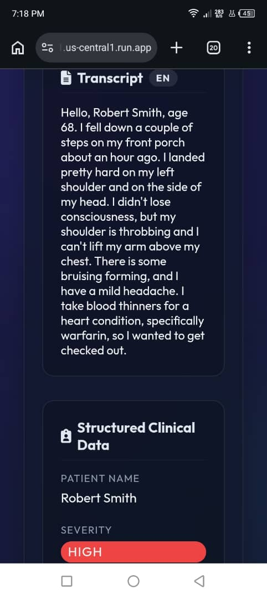
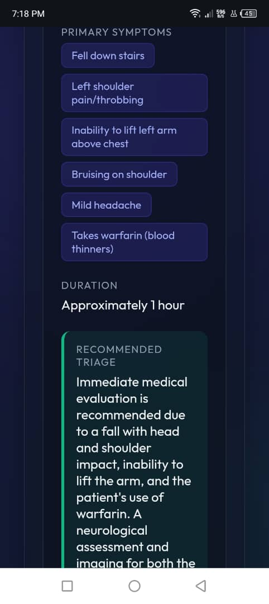
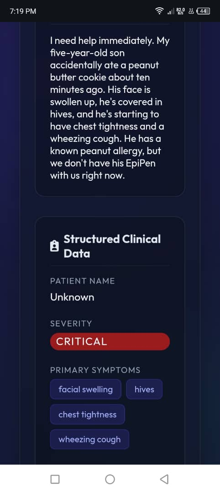
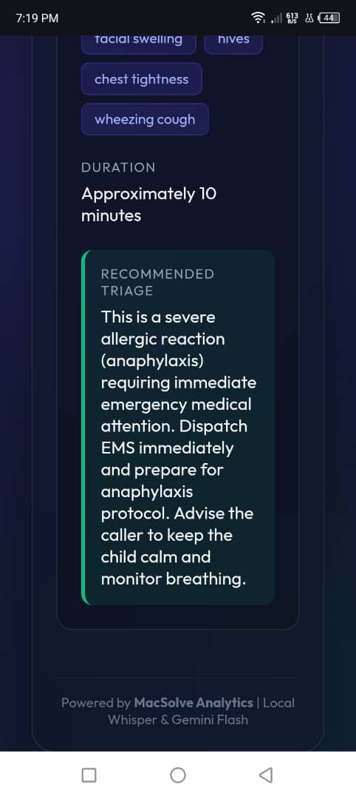
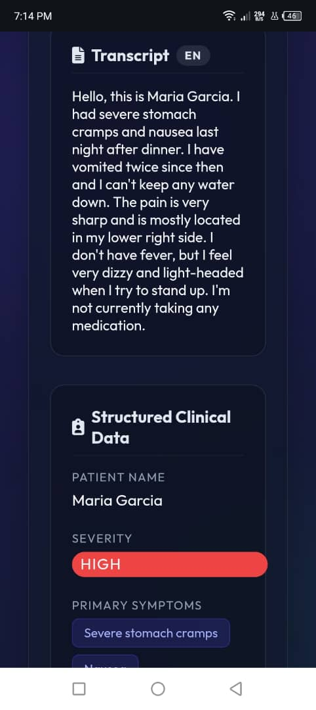
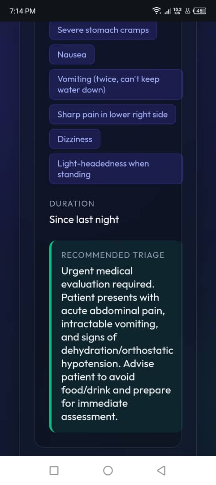

# Med-Triage Voice

A production-ready clinical intake application that democratizes medical data entry. The system leverages state-of-the-art context-aware audio transcription and generative AI to automatically transcribe complex patient scenarios, extracting severity, duration, and structured clinical symptoms into an accessible interface.

**Live Demo:** [med-triage-voice.us-central1.run.app](https://med-triage-voice-827935956281.us-central1.run.app)

---

## Scenarios in Action

### Scenario 1: Elderly Fall Risk with Blood Thinners (High Severity)
| Audio Transcript | Extracted Triage Data |
| :---: | :---: |
|  |  |

### Scenario 2: Pediatric Anaphylaxis (Critical Severity)
| Audio Transcript | Extracted Triage Data |
| :---: | :---: |
|  |  |

### Scenario 3: Acute Abdominal Pain, Possible Appendicitis (High Severity)
| Audio Transcript | Extracted Triage Data |
| :---: | :---: |
|  |  |

---

## How It Works

The system utilizes a custom pipeline to guarantee precise medical record extraction and formatting:

```text
Patient speaks their symptoms
        ↓
System records and processes audio locally
        ↓
   ┌────────────────────────────────────┐
   │                                    │
   │      faster-whisper Engine         │
   │  (Generates high-accuracy          │
   │   context-aware medical text)      │
   │                                    │
   └──────────────┬─────────────────────┘
                  ↓
Prompt Engineer synthesizes context + transcript
(Enforces strict clinical structure & parsing rules)
                  ↓
       Google Gemini Generative LLM
                  ↓
    JSON Structured Data sent to UI
```

**Example interactions:**
- Patient audio: "I fell down stairs, my left shoulder is throbbing, and I take blood thinners." → System correctly extracts High Severity, symptom chips, duration, and urgent neurological triage recommendations.
- Patient audio: "Severe stomach cramps and nausea, mostly lower right side." → System extracts isolated symptoms and generates clinical flags.

---

## Features

- **Voice-to-Text Transcription** — Extremely accurate voice transcription tailored for clinical subtleties using `faster-whisper`.
- **Context-Aware Processing** — Interprets varying accents and colloquial speech seamlessly into standardized clinical terminology.
- **Intelligent Triage** — Uses Google's Gemini to categorize symptom severity, duration, and recommend proper medical evaluation protocols.
- **Micro-Structured Entities** — Parses spoken words into discrete JSON metadata tags (e.g., extracting "Mild headache" and "Bruising" as separate variables).
- **Responsive Dark-Mode UI** — A premium, glassmorphic diagnostic interface that looks great on mobile and desktop.
- **Cloud-Native Architecture** — Containerized and fully decoupled, deployed seamlessly on Google Cloud Run.

---

## Tech Stack

| Layer | Technology |
|-------|------------|
| Frontend | Vanilla HTML5, CSS3, JavaScript (ES6+), Web Audio API |
| Backend | FastAPI, Python 3.11 |
| Transcription | OpenAI Whisper (`faster-whisper`), FFmpeg |
| LLM | Google Gemini Flash |
| Containerization| Docker |
| Hosting | Google Cloud Run |

---

## Core Components

```python
def transcribe_audio(audio_path: str) -> str:
    """Uses CPU-optimized int8 Whisper model to accurately convert patient speech into text."""
    # Instantiates faster-whisper to handle complex clinical context
    
def extract_clinical_data(transcript: str) -> dict:
    """Prompts Gemini to strictly map patient symptoms into structured JSON format."""
    # Guarantees standard outputs (Patient Name, Severity, Duration, Symptoms)
```

---

## API Endpoints

| Method | Endpoint | Description |
|--------|----------|-------------|
| `GET` | `/` | Serves the web-based dictation UI |
| `POST` | `/api/triage/process-audio` | Accepts a `.wav` file, transcribes it, and returns a JSON payload with structured data |

### POST /api/triage/process-audio

**Request:**
`multipart/form-data` containing `file` (the audio blob)

**Response:**
```json
{
  "transcript": "I had severe stomach cramps and nausea last night after dinner. The pain is located mostly in my lower right side.",
  "data": {
    "patient_name": "Maria Garcia",
    "severity": "HIGH",
    "primary_symptoms": ["Severe stomach cramps", "Nausea", "Lower right side pain"],
    "duration": "Since last night",
    "recommended_triage": "Immediate evaluation for potential appendicitis recommended."
  }
}
```

---

## Running Locally

```bash
git clone https://github.com/merezki-11/Med-Triage-Voice.git
cd Med-Triage-Voice
python -m venv venv
```

Activate virtual environment:
```bash
# On Windows
venv\Scripts\activate
# On Mac/Linux
source venv/bin/activate
```

Install System and Python Dependencies (FFmpeg required):
```bash
pip install -r requirements.txt
```

Create a `.env` file:
```
GEMINI_API_KEY=your_gemini_api_key_here
```

Start the application:
```bash
uvicorn app.main:app --reload
```

App runs at `http://127.0.0.1:8000`

---

## Project Structure

```text
Med-Triage-Voice/
│
├── app/
│   ├── main.py              # FastAPI core
│   ├── routers/             # Endpoint definitions
│   ├── services/            # Transcription & Extraction logic
│   └── static/              # Frontend UI assets (HTML, CSS, JS)
│
├── temp_audio/              # Fast cache for decoding buffers
├── Dockerfile               # Production container config
├── requirements.txt         # Pinned Python dependencies
└── README.md
```

---

## Author

**Macnelson Chibuike**
- GitHub: [@merezki-11](https://github.com/merezki-11)
- LinkedIn: [Macnelson Chibuike](https://www.linkedin.com/in/macnelson-chibuike)

---

## License

This project is open source and available under the [MIT License](LICENSE).
